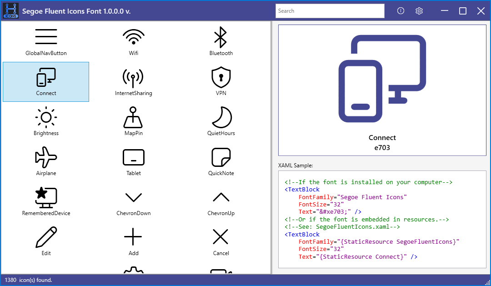

  

Segoe Fluent Icons Font
=======================
In this example, developer guidelines for the usage of the "Segoe Fluent Icons Font" are provided, and each icon is listed along with its Unicode value and descriptive name.

You can use the sample application to search for icons in C# WPF applications that you want to develop.

**Warning** This sample requires Microsoft Visual Studio Community 2019 .NET Framework 4.5 or a later version (any SKU).

To get a copy of Visual Studio, go to [Visual Studio Downloads](http://go.microsoft.com/fwlink/p/?linkid=301697).

Screenshot
--

  

What do application codes cover?
--

- Usage of over 1000 developed icons in applications
- Customization of window title
- Running a single instance of the application
- Quick filtering within ListView (Search, Virtualizing)
- Customization of vertical and horizontal scroll bar appearances
- Creation of WPF control object (SearchTextBox)
- Connecting objects to each other (Binding)
- Generates sample icon code for WPF xaml
- Saving and loading user settings

References
----------

[Segoe Fluent Icons Font](https://learn.microsoft.com/en-us/windows/apps/design/style/segoe-fluent-icons-font)

[Virtualizing Wrap Panel](https://github.com/sbaeumlisberger/VirtualizingWrapPanel)

Copyright & License
-------------------

Copyright (c) 2022, Handeck

The code is under MIT License. (see [LICENSE](LICENSE))
